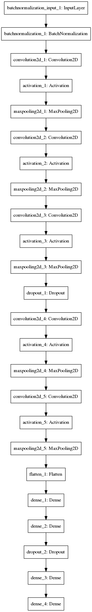
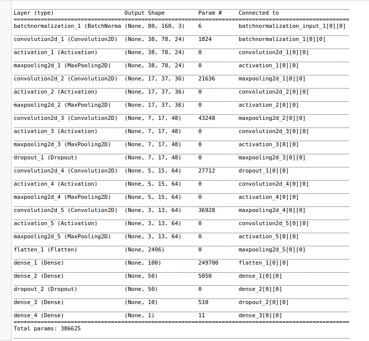
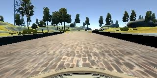

# Readme

### Video
https://www.youtube.com/watch?v=w0F8R3n_m1k

### Special Instructions
* The model was trained and tested using the first track
* The drive.py file has been modified to accomodate image transformation for the model
* Model.py contains all functions necessary for generating new data, training the model and validating the model
* Model.py requires image data to be stored in the same directory within an ./IMG folder
* Model.py also requires driving_log.py to be located in the same directory

### Solution Approach

The model uses the network architecture that is described in the NVIDIA paper. The only differences include the input image size and the addition of dropout layers. Images are resized by 50%. This reduces the feature space and associated training times. This technique was recommended by others in the forum and P3 guide. I did not test the model with full size images. 

### Model Structure

The model input must contain 3 channels within an input size that is half the size of the recorded simulator images. The model includes a normalization layer to move the average image feature value to 0. The model uses 5 convolution layers with 3 layers that have a 5x5 kernel and 2 layers with a 3x3 kernel. I have implemented a dropout layer between the last 5x5 convolution layer and the first 3x3 layer. The model also has 3 fully connected layers with 100,50, and 10 features. The second dropout layer was added between the second and third fully connnected layer. The last layer consists of a single node with a linear activation. This allows the model to produce continous values as outputs. All other layers use RELU activations. 

The diagram below shows the Keras model graph and the summary provides an overview of the layer sizes, input dimensions, and output dimensions.

#### Model Structure

#### Model Summary

### Model Training and Validation

The model was trained using over 30K images. In addition to the provided class data set, I also generated additional data through the simulator to increase the sample size. I generated ~4 to 5 laps driving at a medium speed with a joystick. In addition, I generated several examples of recovery. The recovery examples were generated from both sides of the track and throughout the track. 

I first attempted to use a model with just the training data set from the project pack. In addition, I used a model that did not include dropout layers. This model performed poorly in the simulator. I next added dropout layers which allowed the model to drive forward, but it did not recover and would drift to one side of the road. I then used the simulator to generate additional training data that included a siginificant sample of recovery incidents.

I retrained the model with the new data set. It was evident that the additional data helped as the loss function was showing greater improvements between epochs and over the course of training compared to prior models. Using this model, I reran the simulation and observed that the model could make it to the first corner, but it struggeled to complete the turn. The model was not able to recover in the corners. With this in mind, I generated about 5K additional sample images in the simulator that were focused on taking the corners and recovering in the corners.

After retraining the model with the additional recovery examples, the model was able to complete a full lap and stayed on the road the entire time. While observing the model, it was clear that there is a bias towards the left hand turns. This makes sense as most turns are left hand turns in track 1. The vehicle behavior also not as smooth as it could be when taking corners and recovering. 

To remove the bias and smooth out the driving behavior, I generated additional data by flipping all of the current images and inverting the steering angle, this resulted in ~54K samples for training testing and validation. The resulting model performed the best of all the models.

#### Simulator Image Sample 

#### Flipped Image Sample

The model was trained using a train/test/validation split. The training data set consisted of 60% of the ~54K images with 30% test and 10% validation. The validation set was saved as a holdout and used to validate the final model. 

I trained the model using the Adam optimizer and MSE as the error measurement. I trained for 5-6 epochs as the loss stopped improving in most instances after 5 epochs. I started with a default learning rate, but the model loss did not seem to improve. I lowered the learning rate to .0001 which improved the training and reduction in loss after each epoch.

I also tested the model on the 2nd track. The model did not perform well at all and was not able to make the first turn. My hypothesis is that the lighting and landscape contribute to the issue. The model was trained on a track with bright lighting and open horizons. The model would need to be trained with examples of conditions that are similar to track 2 to be able to be functional. However, I believe that the model would perform well on a track that is in the same environment as track 1. 
